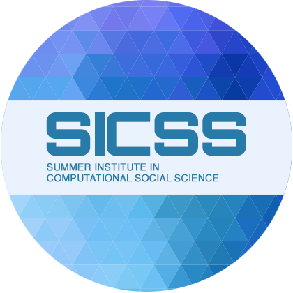
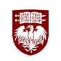
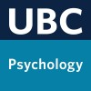

# 🎖 Honors and Awards

<h3> 2024 OpenAI Researcher Access Program</h3>
- Received $3,500 from OpenAI for participating in the Researcher Access Program.

<h3> 2024 SICSS-Beijing Merit-Based Scholarship</h3>
- Received ¥3,600 merit-based scholarship for participating in the SICSS Beijing program.

<h3> 2023 and 2024 UChicago Quadrangle Research Scholarship</h3>
- Awarded a highly competitive merit-based scholarship totaling $80,000 across two years for the Master's of Computational Social Science program.

<h3> 2023 and 2024 UChicago Social Sciences Promise & Merit Scholarship</h3>
- Received a merit-based award totaling $10,000 from the Social Science Division.

<h3> 2021 Quinn Research Assistantship Award</h3>
- Awarded $8,300 to support undergraduate research in psychology, encouraging students to pursue graduate studies and a research career.

<h3> 2021 UBC International Community Achievement Award</h3>
- Received $5,000 for demonstrating leadership in community service, international engagement, and promotion of diversity.

<h3> 2019 and 2020 Trek Excellence Scholarship</h3>
- Awarded $2,000 to students in the top 10% of their undergraduate year, faculty, and school.

<h3> 2019, 2020 and 2022 Faculty of Arts International Student Scholarship</h3>
- Awarded $8,800 across multiple years for international students demonstrating strong academic achievement and scholarly potential.