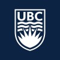

# 🎖 Honors and Awards
<h3>2023.03 Social Sciences Promise & Merit Scholarship</h3>
-  University of Chicago
- Received a merit-based award of $5000 from Social Science Division, the University of Chicago.

<h3>2022.12 Quadrangle Research Scholarship</h3>
-  University of Chicago
- Received $40,000 highly competitive merit-based entrance scholarship to attend the Master's of Computational Social Science program at the University of Chicago.

<h3>2021.12 UBC International Community Achievement Award</h3>
-  The University of British Columbia
- Awards of $5,000 each are available to continuing international undergraduate students who have demonstrated leadership in community service, international engagement, intercultural understanding, promotion of diversity, or intellectual, artistic, or athletic pursuits.

<h3>2021.05 Quinn Research Assistantship Award</h3>
-  UBC Department of Psychology
- These Quinn Research Assistantship awards are meant to stimulate our undergraduate students’ interest in research in psychology. They are also meant to encourage undergraduate students to undertake graduate studies and pursue a research career.

<h3>2020.12 Faculty of Arts International Student Scholarship</h3>
-  The University of British Columbia 
- The International Student Scholarship recognizes international Arts students who demonstrate strong academic achievement, engagement in the Faculty, and the potential to make a scholarly contribution within their chosen field of study.

<h3>2020.10 Trek Excellence Scholarship</h3>
-  The University of British Columbia
- Trek Excellence Scholarships are offered every year to students in the top 10% of their undergraduate year, faculty, and school.

<h3>2019.05 Go Global International Learning Programs Award</h3>
-  The University of British Columbia
