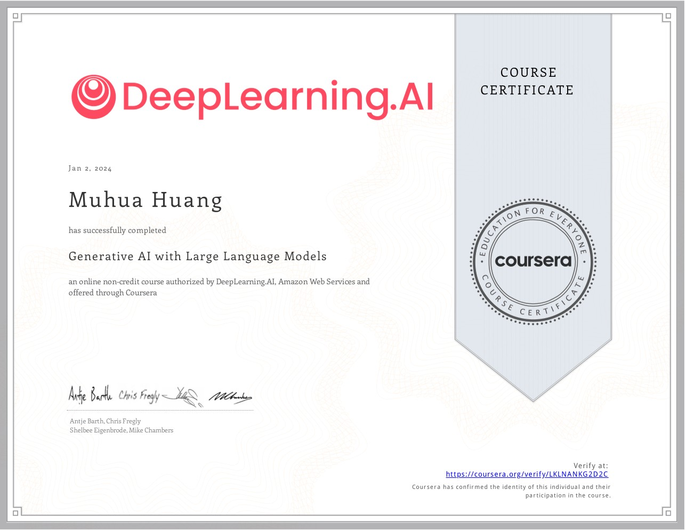

# 📖 Educations
- *2023.08 - 2025.06*, The University of Chicago
  - Master's degree，Computational Social Science
  - GPA: 3.9/4.0

- *2018.09 - 2023.05*, The University of British Columbia
  - Bachelor of Arts - BA，Computer Science & Psychology (Honours)
  - GPA: 4.2/4.3

- *2024.06 - 2024.07*
  - Summer Institute in Computational Social Science (Beijing)
  - My project *"Re-Discovering Big Five using Embeddings"* won Outstanding project award with scholarship. 

- *2021.09 - 2022.09*
  - Google Research Mentorship Program
  - Mentored by Google Research - career planning & state-of-art industrial and application-oriented research sessions

- *2019*, UC Berkeley 
  - Exchange Student 
  - GPA: 4.0/4.0

[//]: # ()
[//]: # (# Conference)

[//]: # (- **Huang, M.** &#40;2024, August&#41;. Designing LLM-Agents with Personalities: A Psychometric Approach. American Psychological Association Convention 2024, Seattle, USA.)

[//]: # (- **Huang, M.**, Zhang, X., & Savalei, V. &#40;2023, August&#41;. How to measure Big Five personality traits better? Exploring alternative scale formats for BFI-2 [Poster]. American Psychological Association 2023 Convention, Washington, DC.)

[//]: # (- **Huang, M.**, Engstrom, H., & Laurin, K. &#40;2021, May&#41;. Exploring the Association between Socioeconomic Status and Children’s Imagined Future: A Study Using Machine Learning [Poster]. Association for Psychological Science Annual Convention.)

[//]: # (- Savalei, V., & **Huang, M.** &#40;2023, October&#41;. Can SEM Fit Indices Distinguish Between CFA and EFA Data Structures? [Paper] Annual Meeting of the Society for Multivariate Experimental Psychology, Iowa City, Iowa.)

[//]: # (- Engstrom, H., **Huang, M.**, & Laurin, K. &#40;2022a, February&#41;. Different social class backgrounds, different imagined futures [Talk]. 2022 Society for Personality and Social Psychology &#40;SPSP&#41; Annual Convention, San Francisco, CA.)

[//]: # (- Engstrom, H., **Huang, M.**, & Laurin, K. &#40;2022b, July&#41;. Social class differences in children’s hopes and expectations for the future: A machine learning approach. [Talk]. Society in the classroom: Integrating perspectives on how socioeconomic disparities unfold in educational settings, London, England.)

[//]: # (- Conati, C., Murali, R., & **Huang, M.** &#40;2022&#41;. Gauging Student Engagement with an XAI interface via Eye- tracking. IJCAI 2022 Workshop on Explainable Artificial Intelligence, 168.)

# 💻 Internships
Microsoft Research Asia | Research Intern | 2024.7 – 2024.10
* Advisor: Dr. Xiaoyuan Yi, Dr. Xing Xie
  On the Dynamics of LLMs' Values as A Community
- Engineered a scalable multi-agent system facilitating interactions among up to hundreds of AI agents, incorporating reflection mechanisms, Retrieval-Augmented Generation (RAG), and parallel processing.
- Applied social science theories (e.g., Schwartz's Theory of Basic Values) as the theoretical frameworks to
  model and analyze the evolution of AI agents' values through social interactions.
- Utilized Social Network Analysis to examine the formation, structure and change of social networks among
  agents with diverse values.
- Leveraged GraphRAG and NLP to investigate Social Emergence (e.g., unique language, cultural practices,
  organizations and institutions) in LLM-agent communities.
- Designed and conducted experiments to assess the impact of value diversity, population size, and temporal
  factors on agent interactions and social outcomes.

# 👁 Selected Courses
## CS & Statistics
- Algorithms and Data Structures
- Artificial Intelligence
- Computer Hardware and Operating Systems
- Data Visualization
- Gambling Psychology
- Human Computer Interaction Methods
- I/O Psychology
- Linear Algebra
- Machine Learning
- Natural Language Processing
- Software Engineering
- Tests and Measurement

# 📚 Certifications

Course Certificate

[Generative Al with Large Language Models](https://www.coursera.org/account/accomplishments/certificate/LKLNANKG2D2C)
- DeepLearning.AI
- Issued Jan 2024
- This course offers a thorough introduction to Generative AI, structured around engaging coding tasks and quizzes to solidify understanding. Key topics included practical use cases of Generative AI, prompt engineering, model pre-training and fine-tuning, performance evaluation, human value alignment, LLM training with reinforcement learning, and insights into LLM-driven applications.

