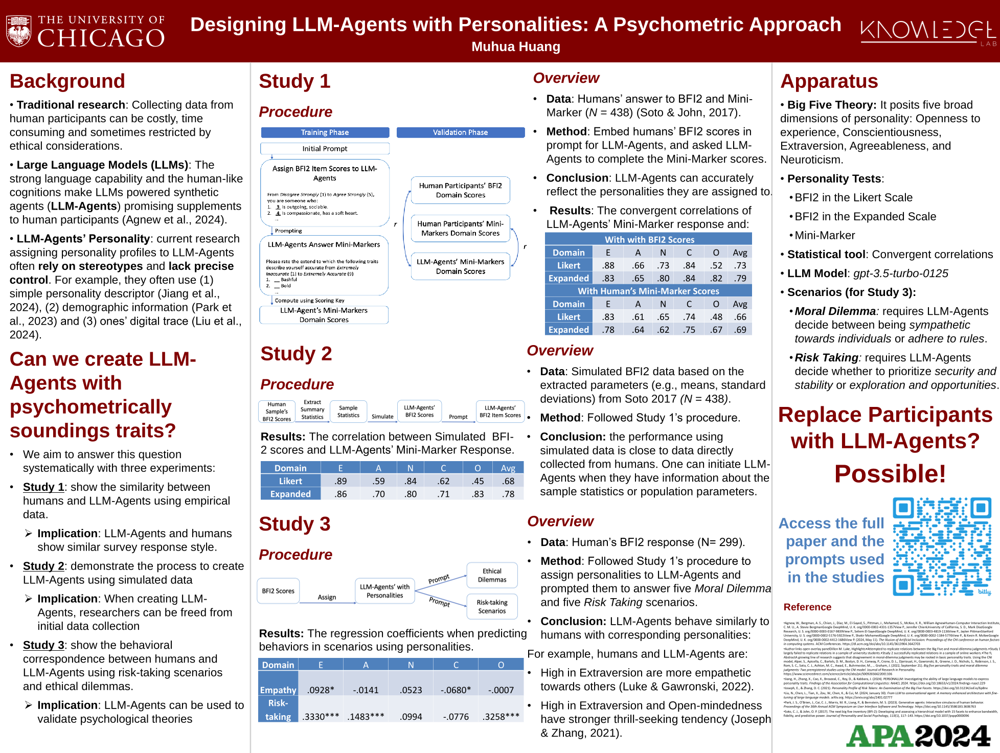
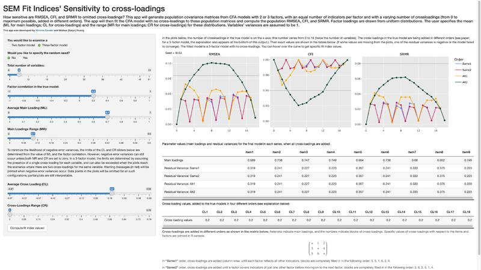
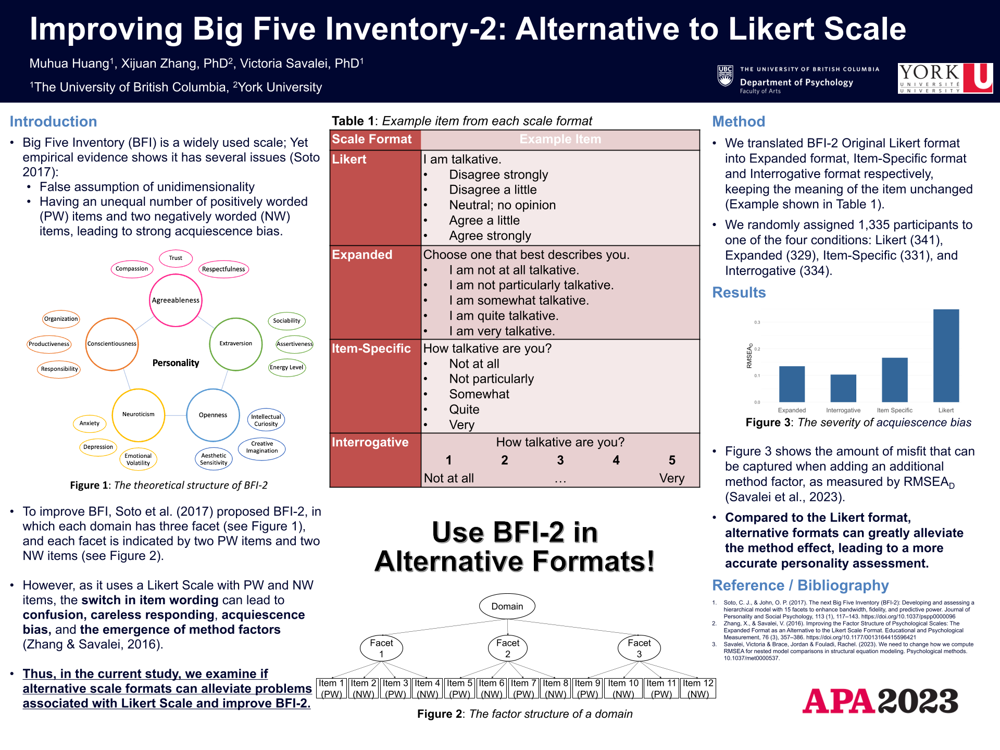
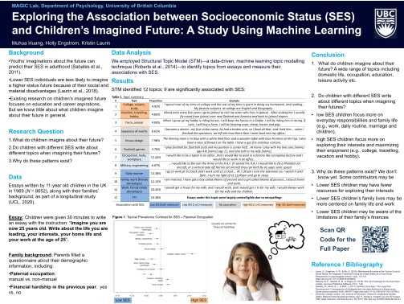
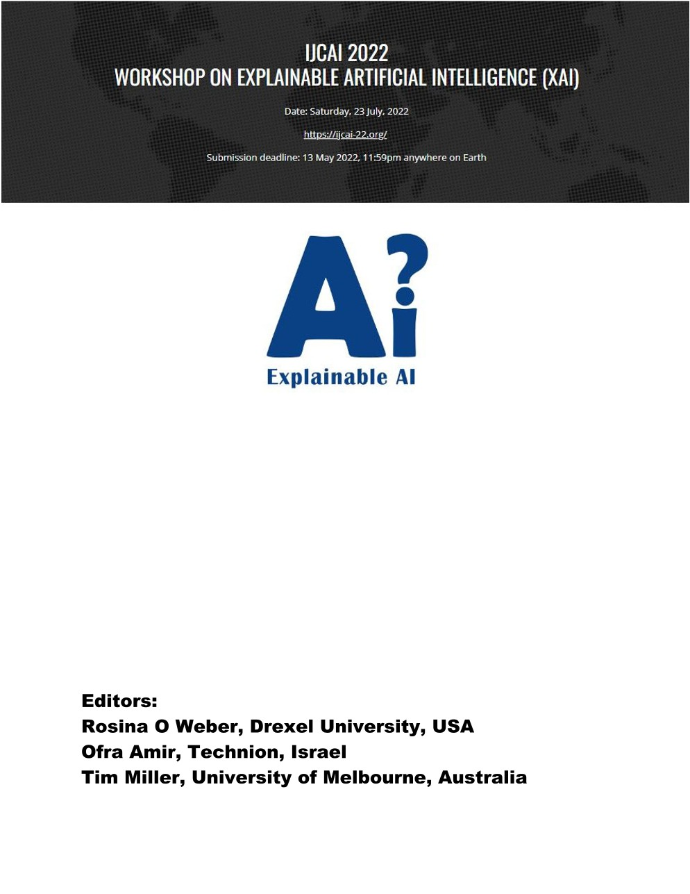

# 🔍 Research Experience

A Psychometrics Approach

[Designing LLM-Agents with Personalities: A Psychometrics Approach](https://media.licdn.com/dms/image/D562DAQH-TMbKmuoXmA/profile-treasury-document-images_1920/1/1722943480692?e=1730937600&v=beta&t=w69T0uwiGhf_JsBSpv16YpeRq_-73VG2qIufyk8Qepw) | 2023.10 – Present
- Presented at American Psychological Association 2024 Convention.
- Explored 5 different personality tests using OpenAI’s large, contextualized embeddings, suggesting new paradigm to analyze psychometric tests.
- Investigated personality assignment strategies using real world data and parametric simulations, allowing controllable, fine-grained and replicable personality assignments to LLM-Agents.
- Collected data from 350 participants and conducted direct comparison for humans and Agents’ response.
- Validated the predictability of Agents’ decision using their personality and comparing that with human participants, showing promising potential to use LLM-Agents as human surrogates in behavioral research.
- Conducted systematic evaluations via Confirmatory Factor Analysis (CFA) and convergent correlations.

Structural Equation Modeling Lab

[Can SEM Fit Indices Distinguish Between CFA and EFA Data Structures](https://media.licdn.com/dms/image/v2/D562DAQFL9HnatVXNAQ/profile-treasury-image-shrink_800_800/profile-treasury-image-shrink_800_800/0/1695343019877?e=1730635200&v=beta&t=yisirJSu4CvhuJT5g4EKwEqvTIXtKL30YrOe4F1_OPk) | 2022.05 - 2023.08
- Developed R Shiny app to simulate experimental data and produce interactive visualizations; Conducted extensive literature search, review, and replication on CFA and EFA models.

- The manuscript has been submitted and currently under review.

Structural Equation Modeling Lab

[Improving Big Five Inventory-2: Alternative to Likert Scale](https://media.licdn.com/dms/image/D562DAQGHiQbUJSi4Og/profile-treasury-document-images_1920/1/1695325799486?e=1730937600&v=beta&t=692ImPEps5H_hmEpE3imVcRwW-oeYJ2JZBrHNQ7Me24) | 2021.08 – 2023.08
- Analyzed survey responses using Structural Equation Modeling (SEM);
- Compared psychometric properties of four scale formats;
- Recruited and communicated with participants;
- Handled survey distribution; Managed compensation process.
- Used Qualtrics and Human Subject Pool platform to oversee the recruitment and data collection progress.
- Presented at American Psychological Association 2023 Convention.

A Stuudy using Machine Learning

[Socioeconomics and Children's Imagined Future: A Stuudy using Machine Learning](https://media.licdn.com/dms/image/v2/D562DAQE9ReXWMG_xTQ/profile-treasury-document-cover-images_480/profile-treasury-document-cover-images_480/0/1695325515774?e=1730635200&v=beta&t=UJDwOJ3PvzSkRsptYcOKpqDeivjxImidts2pdVjB1v4) | 2020.09 – 2021.09
- Analyzed 10,000+ essays and socioeconomic data using Machine Learning and Natural Language Processing (i.e., Structural Topic Model).
- Managed / supervised a group of 20 research assistants; Developed protocols and offered technical support.
- Poster Presentation at the Association for Psychological Science 2020 Annual Convention.

Evaluated personalized explainable AI tutoring system

[Gauging Student Engagement with an Explainable Al interface via Eye-tracking](https://media.licdn.com/dms/image/D562DAQH3C-e0Ren8OQ/profile-treasury-document-images_1280/1/1695340246304?e=1730937600&v=beta&t=kLo3NrxH7RE-YXCOPaMf1ZMGsCF_37qBnXoD4h-uI70) | 2021.11 – 2022.09
- Evaluated personalized explainable AI tutoring system; Analyzed participants’ eye-tracking data and cognitive and personality data using a linear mixed model, demonstrating AI tutoring systems are more effective when tailored to cognitive ability.
- The project the effectiveness of explanation AI in the context of education.
- Presented at IJCAI 2022 Workshop of Explainable Artificial Intelligence

